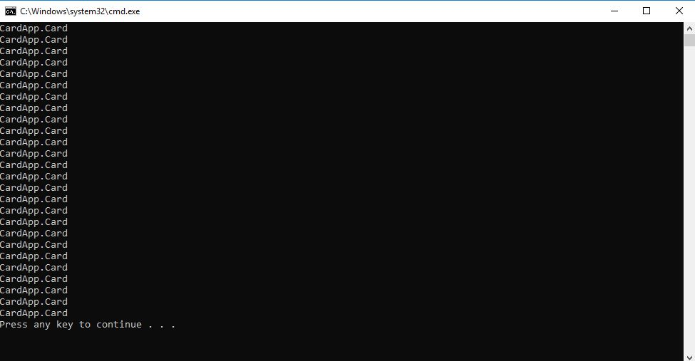

1. Name 
#Lab 08 Collections

2. One-Liner
This is a C# Console Application acting as a card deck manipulator such as adding and removing cards and shuffling.

3. Usage

a. First install appropriate programs. Refer to Step 5 in this README.
b. Upon start up, the deck will instantiate with chosen cards.
c. The user will have the choice of being able to add a card, remove or shuffle.
d. Once any of the choices have been chosen and completed, the program will close.

Visual

4. API
No API's were harmed in the making of this.

5. Installation
Install Visual Studio 2017 and .NET Core SDK.

6. License
This program's License is MIT.